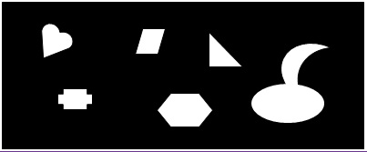

# Templet
- 基于向量相关的模板匹配
- 可以匹配不同旋转后的模板

> 具体算法思路过程可以看[我的博客](http://www.yyf-blog.com/machine-learnning/262.html)。

### 使用方法
1. `git clone` 或者 下载我的项目，然后解压。
2. 进入 /pic后 ，用octave或者matlab打开main.m文件，修改`target`和`test`为自己的图片路径运行。
3. 如果用的是octave，可能需要先执行命令`pkg load image`，用到了image包。
4. 默认旋转角度ang=15°,可以自行修改参数ang达到最佳效果。

大概操作以上。

### 效果图

模板图：

测试图：

模板图旋转后的子图：

结果：

近似值：

